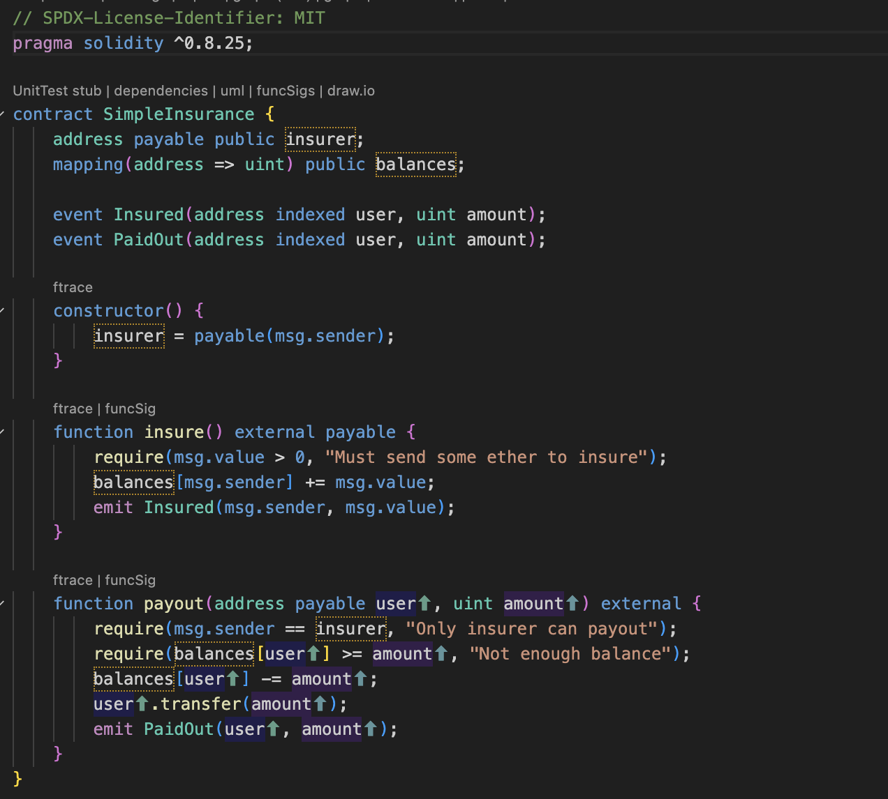
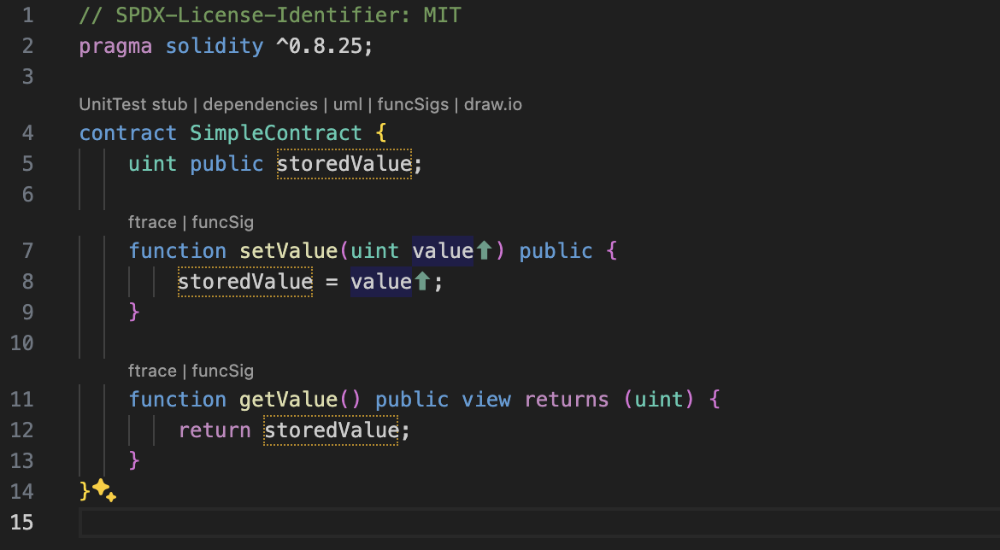

## 什么是 Solidity 和智能合约?

# Solidity 和智能合约简介 (此章节代码只为了让大家更加理解智能合约，大家在这个章节中不需要对代码理解以及学习)

## 1.1 什么是 Solidity 和智能合约？

### 目标

- 了解什么是智能合约，以及它们如何在区块链中起作用。
- 了解 Solidity 作为智能合约编程语言的历史背景和主要用途。
- 掌握以太坊区块链及其虚拟机（EVM）的基础概念，理解智能合约如何在这个环境中运行。

### 内容

#### 1. 智能合约的定义和作用

**智能合约（Smart Contracts）** 是一种自执行的程序，合约的条款由代码控制，自动在区块链上执行。

- **定义**:  
  智能合约是存储在区块链上的一段代码，它定义了交易的规则和协议，并在满足特定条件时自动执行。这种合约不可篡改、透明且能够在没有中介的情况下运行。

- **作用**:  
  智能合约自动执行，并可以减少交易的风险和成本。它们在去中心化金融（DeFi）、数字资产管理、供应链、身份验证、保险等领域得到广泛应用。

**示例**:  
设想一个简单的保险合约：用户支付保费到智能合约中，如果发生特定事件（如航班延误），智能合约会自动向用户支付赔偿金。这减少了中介参与，并保证了赔付的透明和自动化。

**示例代码**（Solidity 语言）:

这个简单的智能合约示例中，用户可以支付保费（通过 insure 函数），当事件发生后，保险商（insurer）可以通过 payout 函数向用户支付赔款。

#### 2. Solidity 的历史和用途

**Solidity** 是专为在以太坊上编写智能合约而设计的一种编程语言。
	•	历史:
	•	Solidity 由 Gavin Wood 等以太坊开发者于 2014 年创建。
	•	它最初是为了在以太坊上开发去中心化应用（DApps）和管理智能合约的需求而设计的。
	•	由于其广泛的支持和易用性，Solidity 成为以太坊平台的主流编程语言。
	•	用途:
	•	Solidity 被广泛用于开发智能合约，用于自动化金融交易、管理资产、创建去中心化自治组织（DAO）等。
	•	开发者使用 Solidity 编写的智能合约，部署到以太坊上后，可以和任何其他兼容以太坊的区块链交互。

- **示例:**
使用 Solidity 可以开发去中心化的交易所（DEX），让用户直接在链上交换代币，而无需中介或中心化机构。

#### 3. 以太坊区块链与 EVM 的基本概念

- **以太坊区块链** 是一个开源的去中心化平台，支持智能合约的部署和执行。
	•	以太坊区块链:
	•	以太坊是一个允许开发者在其上构建和部署智能合约和去中心化应用的区块链平台。
	•	与比特币主要用于支付不同， 以太坊设计的目的就是提供一个去中心化的计算平台。
	•	以太坊的代币 Ether (ETH) 不仅可以用作支付，还可以用来执行智能合约中的操作。
	•	以太坊虚拟机（EVM）:
	•	EVM 是一种专门用于执行智能合约的虚拟机，部署在以太坊区块链的所有节点上。
	•	Solidity 编写的智能合约在编译后会转化为 EVM 字节码，EVM 负责执行这些字节码。
	•	EVM 保证所有节点对合约执行有一致的结果，保证了去中心化和不可篡改性。

- **EVM** 执行智能合约的流程:
	1.	合约由开发者使用 Solidity 编写并编译成字节码。
	2.	编译后的字节码在以太坊区块链上进行部署。
	3.	任何节点在调用智能合约时，EVM 会在本地执行字节码，并同步全网状态。

**示例代码**（Solidity 语言）:
